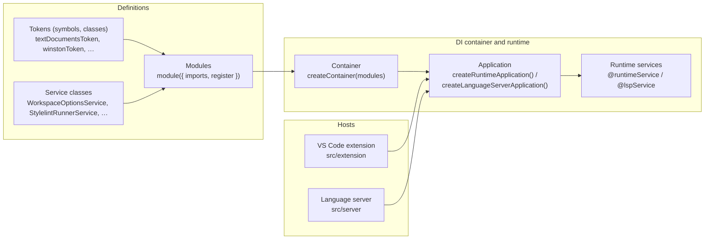

# Architecture of vscode-stylelint

This document is a deep dive into how the extension is wired internally. It is meant for contributors who already have a basic feel for the project and now want to understand how the pieces fit together under the hood.

The goal here is to give you a mental model of the system - how data and control flow through the extension and language server, how the DI/runtime layer glues everything together, and where the main seams are if you want to extend or change behaviour.

This is not a line-by-line reference. Instead, the goal of this document is to cover the architecture at a higher level, so you can find your way around the codebase when working on internals, and understand the design decisions that led to the current structure.

## Table of contents

- [1. High-level system overview](#1-high-level-system-overview)
- [2. The why; some context](#2-the-why-some-context)
- [3. Extension architecture](#3-extension-architecture)
  - [3.1 Activation and application lifecycle](#31-activation-and-application-lifecycle)
  - [3.2 Platform module: binding VS Code to tokens](#32-platform-module-binding-vs-code-to-tokens)
  - [3.3 Extension module: language client, public API, runtime service](#33-extension-module-language-client-public-api-runtime-service)
  - [3.4 ExtensionRuntimeService: commands and notifications](#34-extensionruntimeservice-commands-and-notifications)
- [4. Language server architecture](#4-language-server-architecture)
  - [4.1 Entry point and bootstrap](#41-entry-point-and-bootstrap)
  - [4.2 Server-side modules](#42-server-side-modules)
  - [4.3 Binding LSP into the runtime](#43-binding-lsp-into-the-runtime)
  - [4.4 LanguageServerFeature and runtime](#44-languageserverfeature-and-runtime)
- [5. Shared DI and runtime layer](#5-shared-di-and-runtime-layer)
  - [5.1 Core concepts recap](#51-core-concepts-recap)
  - [5.2 Injection and scopes](#52-injection-and-scopes)
  - [5.3 Modules as architectural seams](#53-modules-as-architectural-seams)
  - [5.4 Runtime applications and services](#54-runtime-applications-and-services)
- [6. Stylelint runtime and workers](#6-stylelint-runtime-and-workers)
- [7. Workspace, documents, and LSP services](#7-workspace-documents-and-lsp-services)
  - [7.1 Workspace services](#71-workspace-services)
  - [7.2 Document and diagnostics services](#72-document-and-diagnostics-services)
  - [7.3 Infrastructure services](#73-infrastructure-services)
- [8. Error handling, logging, and shutdown](#8-error-handling-logging-and-shutdown)
  - [8.1 Error handling](#81-error-handling)
  - [8.2 Shutdown and disposal](#82-shutdown-and-disposal)

## 1. High-level system overview

At runtime, vscode-stylelint is three things working together: a VS Code extension host side that VS Code loads and talks to; a Stylelint language server process that speaks the Language Server Protocol (LSP) and runs Stylelint; and a shared DI + runtime layer that both halves use to describe and compose services.

You can think of it as a small platform built on top of VS Code and LSP. VS Code talks to the extension via the normal extension APIs. The extension starts a language client which talks LSP to a child Node.js process. That child process hosts the language server, whose services are wired via a DI container and a small runtime framework. Most behaviour is implemented as services that are discovered and started by the runtime rather than being manually wired in a central file.

The diagram below shows how the main DI pieces relate to each other in the context of the extension and the language server.



## 2. The why; some context

In the very early days of the extension, all code lived in a few files. This was a manageable approach when the language server and extension were still tiny, but as features were added and complexity grew, it became clear that a more structured architecture was needed.

Back in 2021, a refactor introduced an architecture that separated the extension and server into their own folders and broke the code into a custom "module" concept. This was a marked improvement. It made it easier to reason about which parts of the system were responsible for what, and allowed for better separation of concerns.

However, the module system was still ad-hoc and lacked formal structure. In addition, while largely modular, lower-level calls to LSP types were spread out across individual modules, and dependencies were still wired manually. This led to lots of monkey-patch style mocking in tests, with large and complicated fakes used to replicate the behaviour of dependencies both internal and external. Tests became brittle and hard to maintain, and iterating on the codebase slowed down.

Running Stylelint in-process had its own set of complications. Yarn Plug'n'Play loaders and other module hooks were effectively global, so if one workspace registered a loader that later behaved badly in a different project the only reliable fix was to restart the whole language server.

Multiple workspaces that depended on different versions of Stylelint or slightly different configuration layouts could interfere with each other because there was a single Stylelint instance and a single set of loaders. The CommonJS runtime also made it tempting to rely on monkey-patching and clever resolution hacks that would not translate well to a future where Stylelint is ESM-only or where more advanced module-resolution strategies, such as Yarn Plug'n'Play, need to be supported robustly.

To address these issues, the architecture was overhauled to introduce a formal DI (Dependency Injection) and runtime layer, and the Stylelint runner was moved to a managed set of per-workspace worker processes. This change allowed for better separation of concerns, as services could now be defined independently and wired together declaratively. The use of decorators and metadata made it easier to define LSP-facing services without scattering LSP calls throughout the codebase, and the worker-based Stylelint runtime provided a clear path to robust ESM and Yarn PnP support.

The result is a more maintainable and testable codebase, with clearer boundaries between components and more robust, flexible tests. The DI/runtime layer has become a central part of the architecture, enabling both the extension and server to share common patterns and practices.

The principles behind this architecture are:

- **Feature work should feel local.** Adding or changing a feature should mostly involve working in one place - a service class plus its module registration. You should not need to touch global wiring, hunt for scattered LSP calls, or thread new dependencies through unrelated code.
- **Tests should be cheap to write and cheap to change.** The DI/runtime layer exists so that services can be constructed with small, explicit graphs of dependencies. In tests, that should translate into tiny test modules and focused stubs, not broad monkey-patching of internals or host APIs.
- **Boundaries should be obvious in the code.** The main seams of the system - extension vs. server, runtime vs. Stylelint execution, workspace vs. document concerns - should show up directly in the folder structure, modules, and tokens, so it is clear where a new piece of behaviour belongs and what it is allowed to depend on.
- **Wiring should be declarative and rarely edited.** The DI and runtime layers centralise how services are constructed and discovered. Most features express their wiring through decorators and module registrations; the low-level container and runtime setup should change only rarely and for architectural reasons.
- **Host details should be easy to swap out.** Anything that depends on VS Code, Node, or Stylelint itself should sit behind tokens and dedicated services. That makes it possible to fake or replace these dependencies in tests and to adapt to new hosting or module-resolution environments without rewriting feature code.

The rest of this document starts from the outside with the extension, and works its way inwards towards the server, DI/runtime, and services.

## 3. Extension architecture

The extension side lives under `src/extension/`. Its job is to integrate with VS Code (activation, configuration, commands, notifications), start and manage the language client that talks to the server process, and expose a small public API to other extensions.

Almost all of that work is expressed through the shared DI/runtime layer instead of ad-hoc global state.

### 3.1 Activation and application lifecycle

The main entry point for VS Code is `src/extension/extension.ts`. The `activate(context, overrides?)` function builds and starts a runtime application by calling `createRuntimeApplication(...)` from `src/di/runtime/`. That application is composed from two modules: `createExtensionPlatformModule(context)` for platform wiring and `extensionModule` for the extension's own features. The resulting `RuntimeApplication` owns a DI container, starts runtime services, and becomes the central point for resolving extension services and tokens, for example the public API or the VS Code window.

On deactivate, `deactivate()` asks the application to dispose itself. If disposal fails, the extension falls back to `vscode.window` to show an error and then re-throws so VS Code sees that deactivate failed.

Put simply, the extension is itself a DI-backed application whose lifecycle is bounded by VS Code's activation and deactivation events.

### 3.2 Platform module: binding VS Code to tokens

`src/extension/platform.module.ts` is the only place that talks directly to VS Code's global singletons.

`createExtensionPlatformModule(context: ExtensionContext)` returns a `ModuleMetadata` that provides the `ExtensionContext` under `extensionTokens.context`, exposes `workspace`, `commands`, and `window` under their respective tokens by pulling them from the lazily-loaded VS Code API in `services/environment.ts`, and wires up the `vscode-languageclient/node` module plus the compiled server module path. All of these are published as DI tokens using `provideValue(...)`.

The rest of the extension code never imports `vscode` directly and depends on these tokens instead. This keeps host APIs behind explicit seams and makes them replaceable in tests.

### 3.3 Extension module: language client, public API, runtime service

`src/extension/extension.module.ts` composes the extension's own services on top of the platform module. It registers providers for `extensionTokens.serverOptions` and `extensionTokens.clientOptions`, created by `createServerOptions(...)` and `createClientOptions(...)` in `src/extension/services/language-client.ts`. It also provides `extensionTokens.settingMonitorFactory`, which knows how to create a `SettingMonitor` from the language client module, and `extensionTokens.languageClient`, created by `createLanguageClient(...)` using the language client module, server options, and client options. The module wires up `extensionTokens.publicApi` via `createPublicApi(...)` and registers `ExtensionRuntimeService` itself as a runtime service.

All of these are normal DI providers: the module is just a declarative description of how to build them.

### 3.4 ExtensionRuntimeService: commands and notifications

`ExtensionRuntimeService` in `src/extension/extension-runtime.service.ts` is the main runtime service on the extension side.

It is decorated both as a runtime service, via `@runtimeService()` from `src/di/runtime/`, and as an injectable class, via `@inject({ inject: [...] })` listing the tokens it needs (window, workspace, commands, context, language client, setting monitor factory, public API).

When the runtime application starts, it creates an instance of `ExtensionRuntimeService` from the container and then calls its lifecycle methods (`onStart`, `onShutdown` if implemented).

Inside `ExtensionRuntimeService` you will find the concrete VS Code integration. It wraps the language client in a `SettingMonitor` so that the server starts or stops based on the user's `stylelint.enable` setting. It registers VS Code commands listed in `package.json`, such as `stylelint.executeAutofix` and `stylelint.restart`, by wiring them to LSP commands or notifications against the language client. And it raises events on the public API when the server notifies the extension of features such as document formatting support.

Architecturally, you can think of `ExtensionRuntimeService` as the extension's main function, but expressed as a long-lived service bound into the runtime lifecycle rather than as a single `activate()` body.

> [!NOTE]
> It may be helpful to eventually break `ExtensionRuntimeService` into smaller services for testability and separation of concerns, much the way services on the server-side are designed with decorators such as `@command` in each service class. This hasn't been done just yet, but is a possible future improvement.

## 4. Language server architecture

The language server lives under `src/server/`. It is a standalone Node.js process that owns an LSP `Connection` and a `TextDocuments` manager, uses a DI container and runtime to discover and run services, and delegates Stylelint work to a dedicated runtime layer that can use worker processes.

### 4.1 Entry point and bootstrap

The compiled server is started by `src/extension/start-server.ts` inside the extension host. That entry point calls `createConnection(ProposedFeatures.all)` from `vscode-languageserver/node`, creates a `StylelintLanguageServer` instance from `src/server/server.ts` with the connection and logging options based on `NODE_ENV`, and then calls `server.start()`, after which the connection listens for LSP traffic.

In `src/server/server.ts`, `StylelintLanguageServer.start()` does the architectural heavy lifting. It first creates a feature module, then calls `createLanguageServerApplication()` and starts the resulting `RuntimeApplication`, before finally telling the LSP connection to `listen()`. On dispose, it shuts down the application and disposes the connection.

This mirrors the extension side in that the server is also expressed as a DI-backed application whose lifetime is the life of the LSP `Connection`.

### 4.2 Server-side modules

The core server behaviour is grouped into modules under `src/server/modules/`:

- `platformModule` binds host primitives and Node APIs (TextDocuments, `fs/promises`, `path`, `child_process`, etc.) to tokens.
- `infrastructureModule` contains project-wide infrastructure services such as logging and command dispatch.
- `workspaceModule` holds workspace-level services (`WorkspaceFolderService`, `WorkspaceOptionsService`) that manage configuration and folder roots.
- `stylelintRuntimeModule` wires in the Stylelint runtime integration, describing how Stylelint is loaded and how lint jobs are delegated to worker processes.
- `documentsModule` contains document-oriented services such as document fixes.
- `lspModule` holds LSP-facing glue such as initialization and notification handlers.

`languageServerModule` in `src/server/server.module.ts` simply imports those modules and exposes them as one combined feature module. This keeps the bootstrap in `server.ts` simple: it does not know which services exist, only that there is a composed `languageServerModule` representing them.

### 4.3 Binding LSP into the runtime

`src/server/runtime/application.ts` provides `createLanguageServerApplication(...)`, which adapts the generic runtime into a language-server-aware application. Given an LSP `Connection`, a list of DI modules (platform plus feature modules), and optional overrides or factories, it creates an overrides map that seeds `lspConnectionToken` with the actual `Connection` instance. It then uses `createRuntimeApplication()` to build a runtime application, and finally subscribes to `connection.onShutdown` so the application is disposed when the client shuts down.

From the point of view of the shared runtime, the language server is just another application with a special runtime feature responsible for LSP-specific wiring.

### 4.4 LanguageServerFeature and runtime

The LSP-specific wiring lives in `src/server/runtime/language-server-feature.ts` and `lsp-service-runtime.ts`.

At a high level, `LanguageServerFeature` implements a `RuntimeFeature` from the DI runtime. When the runtime starts, it calls `LanguageServerFeature.apply(context)`. That method resolves infrastructure services from the container, builds a `LanguageServerServiceRuntime` with those dependencies and the LSP `Connection`, walks the set of services and registers any that are LSP-aware, and sets up global LSP behaviour such as `onInitialize`, `onInitialized`, `onShutdown`, and configuration change wiring.

`LanguageServerServiceRuntime` is responsible for the detailed binding between LSP decorators and the actual connection. It inspects service instances that have been marked as `@lspService()`, reads the metadata attached to their methods (event and command handlers, shutdown hooks, and so on), and registers those handlers with the appropriate infrastructure. Commands go through `CommandService`, text document events go through the `TextDocuments` manager, and LSP notifications and requests are bound directly to the `Connection` or routed via `NotificationService`.

The end result is that adding an LSP-facing service is purely declarative. You decorate the class with `@lspService()` and `@inject(...)`, use method-level decorators such as `@command`, `@initialize`, `@textDocumentEvent`, `@notification`, `@completionRequest`, `@codeActionRequest`, `@documentFormattingRequest`, and `@shutdown`, and then register the class in a server module that ultimately ends up in `languageServerModule`.

You never touch the central wiring in `LanguageServerFeature` or `LanguageServerServiceRuntime` for normal feature work, unless a new kind of event or request needs to be supported that isn't already possible with the existing decorators.

## 5. Shared DI and runtime layer

Both the extension and the server are built on the same small DI/runtime library in `src/di/`.

### 5.1 Core concepts recap

From the DI layer's point of view, everything is one of four things.

- **Tokens** are symbolic keys identifying dependencies that are not just other classes: host APIs, third-party libraries, and primitives such as configuration values.
- **Services** are classes decorated with `@inject(...)` that encapsulate behaviour and usually have dependencies injected via their constructor.
- **Modules** are declarative bundles of providers, built with `module({ imports, register })`, that describe what can be built but do not construct anything by themselves.
- **Applications** are containers plus runtime services and features, built with `createRuntimeApplication()` or `createLanguageServerApplication()`.

Architecturally, this means there is no central service locator or god object. Instead, behaviour is sliced into small services, grouped into modules, and then composed into an application for a particular host, i.e. extension or server.

### 5.2 Injection and scopes

The injector lives in `src/di/`. The important pieces are `createToken<T>(description)`, which creates a typed token that can be used as a DI key, and the `@inject({ scope?, inject? })` decorator, which marks a class as injectable and declares what should be passed to its constructor.

The `inject` property lists tokens or classes to resolve for each constructor parameter, while `scope` controls lifetime, defaulting to `singleton` with some helpers using `transient` when a fresh instance is needed each time.

Finally, `createContainer(modules, overrides?)` builds a container from one or more modules. It merges provider graphs from `imports` and `register`, applies overrides for tests or host-specific substitutions, and exposes `resolve(token)` so you can get concrete instances.

The runtime layer (mentioned below) builds on top of this container but does not change its basic rules.

### 5.3 Modules as architectural seams

Modules play two roles. Organisationally, they group related services and tokens by concern. Compositionally, they describe which parts of the system are present in a given application.

A typical module (for example `workspaceModule`) looks like:

```ts
export const workspaceModule = module({
  register: [WorkspaceFolderService, WorkspaceOptionsService]
});
```

More complex modules import others and register factories or value providers. The important part is that modules are declarative, and composition happens by listing modules at application creation time.

For example, the server application uses `platformModule` with host bindings, `languageServerModule` with all server features, and an extra module registering logging. The extension uses `createExtensionPlatformModule(context)` together with `extensionModule`.

From an architectural standpoint, you can see modules as the wiring layer that says which services exist in a given process.

### 5.4 Runtime applications and services

The runtime layer in `src/di/runtime/` is where the DI container gains lifecycle and feature concepts.

- A **runtime application** wraps a container and knows how to start runtime services and features via `start()`, dispose them in a controlled order via `dispose()`, resolve dependencies via `resolve(token)` by delegating to the container, and expose metadata about registered services.
- **Runtime services** are classes decorated with `@runtimeService()`. They are created when the application starts, and if they implement `RuntimeLifecycleParticipant` their `onStart` and `onShutdown` hooks are called. `ExtensionRuntimeService` and the language-server LSP services are both examples of runtime services.
- Finally, **runtime features** are pluggable pieces of startup logic that can interpret service metadata in arbitrary ways; `LanguageServerFeature` is the runtime feature that interprets `@lspService()` metadata.

Because the runtime treats services and features generically, the extension and server can share the same machinery even though their hosts and responsibilities are different.

## 6. Stylelint runtime and workers

Running Stylelint efficiently and robustly is its own sub-system, implemented under `src/server/services/stylelint-runtime/` and wired by `stylelintRuntimeModule`.

The main design goals here are to isolate Stylelint loading and execution from the LSP wiring, to support features like Yarn Plug'n'Play (PnP) and different package roots, to support Stylelint as an ESM module, and to keep the language server reliable and isolated by delegating work to worker processes.

At a high level, the Stylelint runtime consists of several cooperating services:

- **Package and configuration discovery** is handled by services such as `PackageRootCacheService` and `PnPConfigurationCacheService`, which identify where Stylelint should be loaded from for a given workspace folder and how to configure its module resolution.
- **Worker registry and lifecycle** are managed by `WorkerRegistryService`, which owns worker processes that actually run Stylelint and exposes methods like `runWithWorker(...)` that take a callback and provide a worker instance.
- **Workspace-level orchestration** lives in `WorkspaceStylelintService` and its siblings, which coordinate package and configuration discovery with worker execution by turning high-level lint requests with document URIs and options into concrete worker calls.
- The **runner service**, `StylelintRunnerService`, is the main facade the rest of the server uses; it knows how to run Stylelint on documents or files given workspace options.

The LSP document services never talk to Stylelint directly. They depend on workspace and runner services via DI, which keeps the LSP layer unaware of implementation details such as workers, PnP, or whether Stylelint is CJS or ESM.

This keeps the Stylelint runtime concerns localised and makes it possible to evolve how Stylelint is actually executed - such as new Node versions, different loader strategies, future Stylelint breaking changes - without rewriting the LSP-facing code or making hard dependencies on the Node.js runtime running the language server or the extension.

## 7. Workspace, documents, and LSP services

Most of the server's feature code lives under `src/server/services/`, grouped by concern: workspace, documents, infrastructure, stylelint runtime, LSP helpers.

Here is how they relate at a conceptual level.

### 7.1 Workspace services

Workspace services in `src/server/services/workspace/` are responsible for tracking workspace folders and associated metadata via `WorkspaceFolderService`, loading and caching Stylelint options for particular URIs or workspace folders via `WorkspaceOptionsService`, and reacting to configuration changes, for example via `DidChangeConfigurationNotification`.

They are wired into LSP events via decorators, with initialization handlers to report capabilities and perform initial scans, and configuration change handlers to clear caches or recalculate options.

Other services, such as the Stylelint runner and document services, depend on workspace services to obtain configuration rather than re-implementing their own config logic.

### 7.2 Document and diagnostics services

Document services in `src/server/services/documents/` handle document-oriented tasks such as computing diagnostics when documents change, providing document fixes and code actions, and implementing document formatting via Stylelint when that feature is enabled.

These services are typically LSP-facing. They are decorated with `@lspService()` and method-level decorators like `@textDocumentEvent(eventName)`, `@codeActionRequest()`, or `@documentFormattingRequest()`. They depend on `TextDocuments`, workspace services, and the Stylelint runner via DI, and they use `NotificationService` or direct connection APIs to publish diagnostics and other LSP notifications.

The point is to keep each service focused on a single responsibility, such as "turn a Stylelint result into LSP diagnostics and publish them", while letting the runtime handle the glue to the rest of the system.

### 7.3 Infrastructure services

Infrastructure services in `src/server/services/infrastructure/` provide shared building blocks. `CommandService` is a simple command bus used by `@command` handlers, so LSP commands from the client are routed through this service to the appropriate handlers. `NotificationService` is a facade around LSP notifications, used to centralise error handling and logging. Logging services are abstractions over `winston` that provide structured logging and control over log levels and destinations.

These services are consumed everywhere, but they are still normal DI services. Nothing in the system reaches into global singletons for commands or logs.

## 8. Error handling, logging, and shutdown

Two system-wide concerns that are easy to overlook when reading code are error handling and shutdown. Architecturally, they are handled via the same DI/runtime patterns.

### 8.1 Error handling

On the server side, LSP handlers registered via decorators are wrapped so that exceptions are caught and logged instead of crashing the process. `NotificationService` and the logging services centralise how errors are reported back to the client, and the Stylelint runtime isolates worker failures and converts them into structured results where possible.

On the extension side, `ExtensionRuntimeService` decides when to surface errors to the user, for example via `showErrorMessage`, versus when to log silently, and `deactivate()` explicitly shows an error if the application fails to dispose cleanly.

### 8.2 Shutdown and disposal

Shutdown is driven from the outside in. The client sends LSP `shutdown` and `exit`, which eventually result in `connection.onShutdown` firing. `createLanguageServerApplication` has already subscribed to `onShutdown`, so it disposes the runtime application. The runtime application, in turn, calls `onShutdown` on runtime services, disposes registered features such as `LanguageServerFeature`, and lets infrastructure services release resources such as workers, file handles, and loggers.

On the extension side, VS Code calling `deactivate` similarly leads to the runtime application being disposed and the language client being stopped.

Because lifecycle is a first-class concept of the runtime, you very rarely see manual `dispose` calls scattered around; instead, services use the `@shutdown` decorator and rely on the runtime to invoke the decorated methods at the right time.
