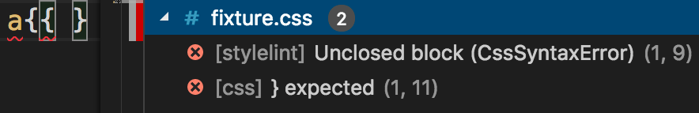

# vscode-stylelint

[](https://travis-ci.org/shinnn/vscode-stylelint)

A [Visual Studio Code](https://code.visualstudio.com/) extension to lint [CSS](https://www.w3.org/Style/CSS/)/[SCSS](https://sass-lang.com/documentation/file.SASS_REFERENCE.html#syntax)/[Less](http://lesscss.org/) with [stylelint](https://stylelint.io/)


## Installation

1. Execute `Extensions: Install Extensions` command from [Command Palette](https://code.visualstudio.com/docs/getstarted/userinterface#_command-palette).
2. Type `@sort:installs stylelint` into the search form and install the topmost one.

Read the [extension installation guide](https://code.visualstudio.com/docs/editor/extension-gallery) for more details.

### Optional (but recommended) setup



To prevent both [the editor built-in linters](https://code.visualstudio.com/docs/languages/css#_syntax-verification-linting) `[css]` `[less]` `[scss]` and this extension `[stylelint]` from reporting essentially the same errors like in the screenshot, disable the built-in ones in User or Workspace [setting](https://code.visualstudio.com/docs/getstarted/settings):

```json
"css.validate": false,
"less.validate": false,
"scss.validate": false
```

## Usage

Once a user follows [the stylelint startup guide](https://github.com/stylelint/stylelint#getting-started) by creating a [configuration](https://stylelint.io/user-guide/configuration/) file or by editing [`stylelint.*` VSCode settings](#extension-settings), stylelint automatically validates documents with these [language identifiers](https://code.visualstudio.com/docs/languages/overview#_language-id):


* CSS (`css`)
* HTML (`html`)
* Less (`less`)
* Markdown (`markdown`)
* [Markdown+MathML (`source.markdown.math`)](https://marketplace.visualstudio.com/items?itemName=goessner.mdmath)
* [PostCSS (`postcss`)](https://marketplace.visualstudio.com/items?itemName=mhmadhamster.postcss-language)
* [Sass (`sass`)](https://marketplace.visualstudio.com/items?itemName=robinbentley.sass-indented)
* SCSS (`scss`)
* [Sugarss (`sugarss`)](https://marketplace.visualstudio.com/items?itemName=mhmadhamster.postcss-language)
* [Vue (`vue`, `vue-html`)](https://marketplace.visualstudio.com/items?itemName=octref.vetur)
* XML (`xml`)

If either [stylelint-processor-glamorous](https://github.com/zabute/stylelint-processor-glamorous) or [stylelint-processor-styled-components](https://github.com/styled-components/stylelint-processor-styled-components) is installed and [enabled](https://github.com/stylelint/stylelint/blob/master/docs/user-guide/configuration.md#processors), stylelint also validates the followings:

* JavaScript (`javascript`)
* JavaScript React (`javascriptreact`)
* styled-components
  * [Official (`source.css.styled`)](https://marketplace.visualstudio.com/items?itemName=jpoissonnier.vscode-styled-components)
  * [Userland (`styled-css`)](https://marketplace.visualstudio.com/items?itemName=mgmcdermott.vscode-language-babel)
* TypeScript (`typescript`)
* TypeScript React (`typescriptreact`)

### Extension settings

Though it's highly recommended to add a [stylelint configuration file](https://stylelint.io/user-guide/example-config/) to the current workspace folder instead, the following extension [settings](https://code.visualstudio.com/docs/getstarted/settings) are also available.

#### stylelint.enable

Type: `boolean`  
Default: `true`

Control whether this extension is enabled or not.

#### stylelint.configOverrides

Type: `Object`  
Default: `null`

Set stylelint [`configOverrides`](https://github.com/stylelint/stylelint/blob/master/docs/user-guide/node-api.md#configoverrides) option.

#### stylelint.config

Type: `Object`  
Default: `null`

Set stylelint [`config`](https://github.com/stylelint/stylelint/blob/master/docs/user-guide/node-api.md#config) option. Note that when this option is enabled, stylelint doesn't load configuration files.

## License

[ISC License](./LICENSE.txt) © 2018 Shinnosuke Watanabe
