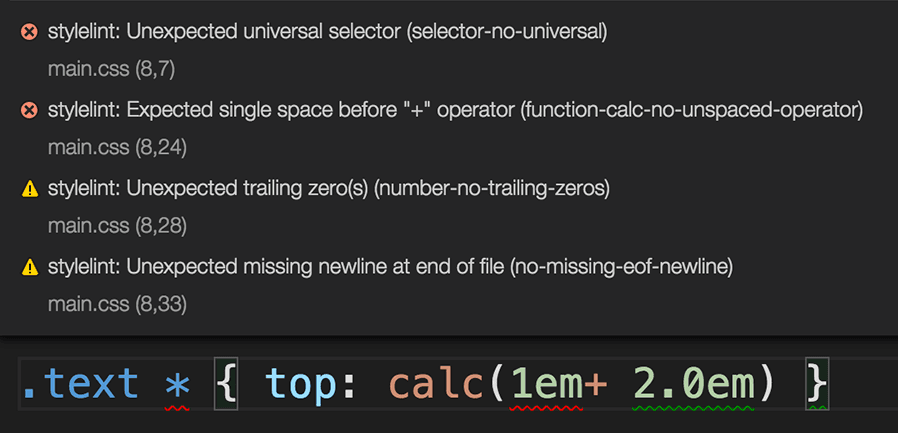

# vscode-stylelint

[](https://github.com/stylelint/vscode-stylelint/actions/workflows/testing.yml)
[](https://github.com/stylelint/vscode-stylelint/actions/workflows/linting.yml)

The official [Visual Studio Code] extension for [Stylelint]



<!-- cspell:disable-next-line -->

> **Notice:** 1.x of this extension has breaking changes from 0.x versions, including, but not limited to, changes to which documents are linted by default. See the [migration section](#migrating-from-vscode-stylelint-0xstylelint-13x) for more information.

**Table of Contents**

- [Installation](#installation)
  - [Disable VS Code's Built-In Linters (optional)](#disable-vs-codes-built-in-linters-optional)
- [Usage](#usage)
   <!-- prettier-ignore -->
   <!-- cspell:disable-next-line -->
- [Migrating from vscode-stylelint 0.x/Stylelint 13.x](#migrating-from-vscode-stylelint-0xstylelint-13x)
  - [⚠️ Stylelint 13.x and Prior is No Longer Supported](#%EF%B8%8F-stylelint-13x-and-prior-is-no-longer-supported)
  - [⚠️ Stylelint is No Longer Bundled](#%EF%B8%8F-stylelint-is-no-longer-bundled)
  - [⚠️ Only CSS and PostCSS are Validated by Default](#%EF%B8%8F-only-css-and-postcss-are-validated-by-default)
- [Extension Settings](#extension-settings)
- [Commands](#commands)
- [Troubleshooting](#troubleshooting)
- [Licence](#licence)

## Installation

1. Execute the `Extensions: Install Extensions` command from the [Command Palette].
2. Type `@id:stylelint.vscode-stylelint` into the search form and install the topmost one.

The extension first looks for a copy of Stylelint installed in the open workspace folder, then for a globally installed version if it can't find one. If neither can be found, it will not lint any documents.

Read the [extension installation guide] for more details.

### Disable VS Code's Built-In Linters (optional)

To prevent both [VS Code's built-in linters] and Stylelint from reporting the same errors, you can disable the built-in linters in either the [user or workspace settings][vscode settings] for the languages you intend to use in your workspace.


_An example of duplicate error messages emitted by both the built-in linter and vscode-stylelint._

For example, the following entries in `.vscode/settings.json` would disable the built-in CSS, Less, and SCSS linters:

```json
"css.validate": false,
"less.validate": false,
"scss.validate": false
```

## Usage

> See the [Stylelint getting started guide] for more information.

Once you create a [Stylelint configuration file] or configure [the Stylelint extension's settings](#extension-settings), Stylelint will automatically validate CSS and [PostCSS][postcss extension] documents (those with [language identifiers] `css` and `postcss`, respectively).


_You can see or change the current document's language in the bottom-right corner of the editor window._

## Migrating from vscode-stylelint 0.x/Stylelint 13.x

### ⚠️ Stylelint 13.x and Prior is No Longer Supported

> See also: [Stylelint 14 migration guide]

vscode-stylelint 1.x expects to use Stylelint 14 at minimum. Usage with prior versions of Stylelint is no longer supported. While older versions may continue to work for a while, you may encounter unexpected behaviour. You should upgrade your copy of Stylelint to version 14 or later for the best experience.

The `syntax` and `configOverrides` options have been removed from Stylelint 14 and this extension. See the [following section](#%EF%B8%8F-only-css-and-postcss-are-validated-by-default) for information on how to use different syntaxes.

### ⚠️ Stylelint is No Longer Bundled

Unlike 0.x, 1.x no longer provides a copy of Stylelint bundled with the extension. Bundling Stylelint brought up many unwanted side effects and significantly increased the extension's size.

Starting with 1.x, vscode-stylelint will depend on having a copy of Stylelint installed in the open workspace (recommended) or globally (not recommended). If the extension doesn't seem to be linting any documents, make sure you have Stylelint installed.

### ⚠️ Only CSS and PostCSS are Validated by Default

The 0.x versions of this extension, which used Stylelint 13.x and prior, supported validating many different languages out of the box without any additional configuration. However, this added a lot of complexity and resulted in many cases of unwanted or unexpected behaviour.

In current versions of the extension, the extension only supports validating CSS and PostCSS out of the box and requires additional configuration to validate other languages. You will need to:

1. Install the PostCSS syntax for the language you want to validate into your workspace, e.g. [postcss-scss].
   <!-- prettier-ignore -->
   <!-- cspell:disable-next-line -->
1. Configure Stylelint to use the syntax by providing the module name in the [`customSyntax`] option using overrides (or use the [corresponding option](#stylelintcustomsyntax) in this extension's settings).

   Example Stylelint config:

   ```js
   module.exports = {
     overrides: [
       {
         files: ["**/*.scss"],
         customSyntax: "postcss-scss"
       }
     ]
   };
   ```

    <!-- prettier-ignore -->
    <!-- cspell:disable-next-line -->

1. Add the [language identifiers] for the documents you want to validate to the extension's workspace or user settings using the [`stylelint.validate`](#stylelintvalidate) option.

   Example VS Code config:

   ```json
   {
     "stylelint.validate": ["css", "scss"]
   }
   ```

## Extension Settings

Though relying on a [Stylelint configuration file] in your project is highly recommended, you can instead use the following [extension settings][vscode settings]:

### `stylelint.enable`

> Type: `boolean`  
> Default: `true`

Controls whether this extension is enabled or not.

### `stylelint.config`

> Type: `Object`  
> Default: `null`

Sets the Stylelint [`config`] option. Note that when this option is enabled, Stylelint doesn't load configuration files.

### `stylelint.configFile`

> Type: `string`  
> Default: `""`

Sets the Stylelint [`configFile`] option. Path to a JSON, YAML, or JS file that contains your configuration object. Use this option if you don't want Stylelint to search for a configuration file.

### `stylelint.configBasedir`

> Type: `string`  
> Default: `""`

Sets the Stylelint [`configBasedir`] option. The path to the directory to which relative paths defining "extends" and "plugins" are relative. Only necessary if these values are relative paths.

### `stylelint.customSyntax`

> Type: `string`  
> Default: `""`

Sets the Stylelint [`customSyntax`] option, which points to a [PostCSS syntax] module. Must be either the package name or an absolute path to the module.

e.g.

```json
  "stylelint.customSyntax": "sugarss"
```

You can use `${workspaceFolder}` to refer to the folder opened in VS Code.

e.g.

```json
  "stylelint.customSyntax": "${workspaceFolder}/custom-syntax.js"
```

### `stylelint.ignoreDisables`

> Type: `boolean`  
> Default: `false`

Sets the Stylelint [`ignoreDisables`] option. If `true`, Stylelint ignores `stylelint-disable` (e.g. `/* stylelint-disable block-no-empty */`) comments.

### `stylelint.reportNeedlessDisables`

> Type: `boolean`  
> Default: `false`

Sets the Stylelint [`reportNeedlessDisables`] option. If `true`, Stylelint reports errors for `stylelint-disable` comments that are not blocking a lint warning.

### `stylelint.reportInvalidScopeDisables`

> Type: `boolean`  
> Default: `false`

Sets the Stylelint [`reportInvalidScopeDisables`] option. If `true`, Stylelint reports errors for `stylelint-disable` comments referring to rules that don't exist within the configuration object.

### `stylelint.validate`

> Type: `string[]`  
> Default: `["css", "postcss"]`

An array of language identifiers specifying which files to validate.

### `stylelint.stylelintPath`

> Type: `string`  
> Default: `""`

Used to supply a custom path to the Stylelint module.

### `stylelint.packageManager`

> Type: `"npm" | "yarn" | "pnpm"`  
> Default: `"npm"`

Controls the package manager to be used to resolve the Stylelint library. This setting only has an effect if the Stylelint library is resolved globally. Valid values are `"npm"` or `"yarn"` or `"pnpm"`.

### `stylelint.snippet`

> Type: `string[]`  
> Default: `["css", "postcss"]`

An array of language identifiers specifying which files to enable snippets for.

### `editor.codeActionsOnSave`

This extension provides an action that you can use with VS Code's [`editor.codeActionsOnSave`][vscode settings] setting. If provided a `source.fixAll.stylelint` property set to `true`, all auto-fixable Stylelint errors will be fixed on save.

```json
  "editor.codeActionsOnSave": {
    "source.fixAll.stylelint": true
  }
```

The following turns on auto fix for all providers, not just Stylelint:

```json
  "editor.codeActionsOnSave": {
    "source.fixAll": true
  }
```

You can also selectively disable Stylelint:

```json
  "editor.codeActionsOnSave": {
    "source.fixAll": true,
    "source.fixAll.stylelint": false
  }
```

You can also selectively enable and disable specific languages using VS Code's language-scoped settings. For example, to disable `codeActionsOnSave` for HTML files, use the following:

```json
  "[html]": {
    "editor.codeActionsOnSave": {
      "source.fixAll.stylelint": false
    }
  }
```

## Commands

This extension contributes the following commands to the command palette:

- `Fix all auto-fixable problems`: applies Stylelint resolutions to all automatically fixable problems.

## Troubleshooting

vscode-stylelint writes logs to the VS Code output panel:


You can enable more verbose log output by running VS Code with the `NODE_ENV` environment variable set to `development`. You can do this on macOS and \*nix by running:

```sh
NODE_ENV=development code
```

And on Windows by running:

```batch
cmd /C "set NODE_ENV=development&&code"
```

## Licence

[MIT](LICENSE)

<!-- Link URLs -->

<!-- Languages -->

[css]: https://www.w3.org/Style/CSS/
[scss]: https://sass-lang.com/documentation/syntax

<!-- PostCSS -->

[postcss extension]: https://marketplace.visualstudio.com/items?itemName=mhmadhamster.postcss-language
[postcss syntax]: https://github.com/postcss/postcss#syntaxes
[postcss-scss]: https://www.npmjs.com/package/postcss-scss

<!-- Stylelint -->

[stylelint]: https://stylelint.io/
[stylelint getting started guide]: https://stylelint.io/user-guide/get-started
[stylelint configuration file]: https://stylelint.io/user-guide/configuration
[stylelint 14 migration guide]: https://github.com/stylelint/stylelint/blob/main/docs/migration-guide/to-14.md
[`customsyntax`]: https://stylelint.io/user-guide/usage/options/#customsyntax
[`config`]: https://stylelint.io/user-guide/usage/node-api#config
[`configfile`]: https://stylelint.io/user-guide/usage/options#configfile
[`configbasedir`]: https://stylelint.io/user-guide/usage/options#configbasedir
[`ignoredisables`]: https://stylelint.io/user-guide/usage/options#ignoredisables
[`reportneedlessdisables`]: https://stylelint.io/user-guide/usage/options#reportneedlessdisables
[`reportinvalidscopedisables`]: https://stylelint.io/user-guide/usage/options#reportInvalidScopeDisables

<!-- Visual Studio Code -->

[visual studio code]: https://code.visualstudio.com/
[command palette]: https://code.visualstudio.com/docs/getstarted/userinterface#_command-palette
[extension installation guide]: https://code.visualstudio.com/docs/editor/extension-gallery
[language identifiers]: https://code.visualstudio.com/docs/languages/overview#_language-identifier
[vs code's built-in linters]: https://code.visualstudio.com/docs/languages/css#_syntax-verification-linting
[vscode settings]: https://code.visualstudio.com/docs/getstarted/settings
